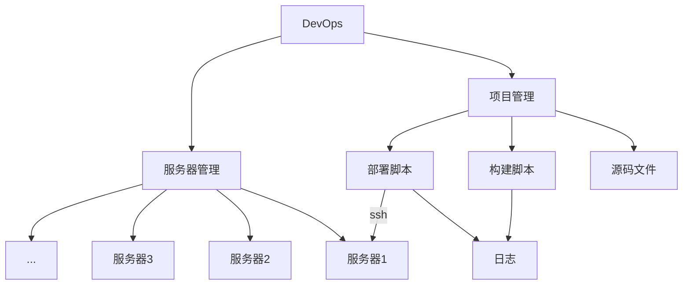

# 轻量级CICD系统设计 v0.2.0

一处构建，多处部署。



## 存储文件结构

```txt
minidevops                      根目录
    └─projects                  项目文件夹
        └─group-1               分组1文件夹
            └─project-1         项目1文件夹
                ├─src           源代码文件夹 
                ├─logs          构建日志文件夹 
                └─index.yml     项目配置
            └─index.yml         项目索引配置
    └─server.yml                服务器配置
```

```conf
# 日志配置
LOG=debug,tower_http=error,wego_devops::controllers::chathub=error
# webapi 地址配置
HOST=0.0.0.0:9600
# web静态文件地址
WEB="D:\\git\\wego\\wego-devops\\web\\dist"
# 存储项目根地址
RootPath="d:\\minidevops"
# 执行脚本超时时间/秒
SHELL_TIMEOUT=600
# shell环境变量
SHELL="/usr/bin/bash"

```

## 部署

```sh
echo '[Service]
WorkingDirectory=/home/devops
ExecStart=/home/devops/wego-devops
Restart=always
RestartSec=10s'>/etc/systemd/system/devops.service

systemctl daemon-reload
systemctl start devops
systemctl enable devops

```

## 部署到服务器

将公钥上传到远程服务器是实现 SSH 无密码登录的关键步骤

```shell
ssh-copy-id -i ~/.ssh/id_rsa.pub user@remote_host
```
